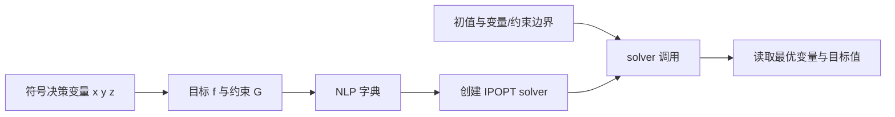

# CasadiDemo：从数学模型到 C++ 优化求解

本仓库是中文图书 **《非结构化场景自动驾驶轨迹规划技术》** 第十三章“非结构化场景轨迹规划软件系统部署方法”的配套代码。书中第 **174 页、第 13.4 节“基于 CasADi 的优化问题建模与求解指令简介”** 引用了本仓库，通过一个小型非线性规划例子介绍 CasADi 的 C++ 建模与求解接口。

English title translation: *Trajectory Planning Techniques for Autonomous Driving in Unstructured Environments*. **This book is written in Chinese.** This repository accompanies Chapter 13 and demonstrates how to formulate and solve a nonlinear program using the CasADi C++ interface.

建议先阅读书中第 13.4 节，再运行 [`casadi_example/casadi_example.cc`](casadi_example/casadi_example.cc)，对照变量、目标函数、约束和求解指令逐项理解。仓库同时保留了一个基于 ROS 1 的车辆轨迹规划工程，可用于进一步阅读搜索、轨迹优化与可视化之间的衔接。

## CasADi 是什么

CasADi 是用于非线性优化和最优控制的开源软件框架。它起源于 KU Leuven 的 OPTEC，由 Joel Andersson 和 Joris Gillis 在 Moritz Diehl 指导下开展；早期目标是以接近计算机代数的表达方式提供自动微分，名称也与此有关。核心使用 C++ 实现，并提供 Python、MATLAB/Octave 等接口。[官方介绍](https://web.casadi.org/docs/#introduction)

其价值在于把数学表达式与数值求解连接起来：用符号变量建立计算图，自动构造稀疏导数，再将目标函数、约束及其导数交给 IPOPT 等求解器。这有助于减少手工推导和维护 Jacobian、Hessian 的工作。CasADi 提供建模与计算工具，具体的车辆模型、离散方法、约束和初值仍由使用者定义。[官方文档](https://web.casadi.org/docs/)

在本例中，**CasADi 负责表达和组织 NLP，IPOPT 负责迭代求解**。

## 先选对运行入口

| 内容 | 入口 | 用途 | 是否需要 ROS |
| --- | --- | --- | --- |
| 第 13.4 节基础例子 | `casadi_example/` | 三个决策变量的 NLP；学习 CasADi 指令 | 否 |
| 车辆轨迹规划工程 | 仓库根目录 | 混合 A*、轨迹优化、ROS 通信与 RViz 展示 | 是，ROS 1 / catkin |

两个目录各有一个 `CMakeLists.txt`。运行书中基础例子时，应使用 `cmake -S casadi_example ...`；根目录 CMake 构建的是 `parking_planner` ROS 包。

## 基础例子的数学问题

程序求解：

$$
\begin{aligned}
\min_{x,y,z}\quad &(x-1)^2+(y-2)^4+(z-3)^6\\
\mathrm{s.t.}\quad &x+z=4,\\
&x+y\geq 3,\\
&y+z\leq 6,\\
&x\geq0,\quad y\leq10,\quad z\geq-9.9.
\end{aligned}
$$

三个非负项同时为零且所有约束成立时，得到全局最优解 **`(x, y, z) = (1, 2, 3)`，目标值为 `0`**。数值解通常接近这个点；四次项和六次项在极小值附近较平坦，不能要求打印出来的每个变量都精确等于整数。

### 数学量与程序对象的对应关系

| 对象 | 代码中的含义 |
| --- | --- |
| `MX::sym("x")`、`y`、`z` | 三个标量符号变量 |
| `w = vertcat(x, y, z)` | 合并后的决策向量 |
| `f` | 目标函数表达式 |
| `G = vertcat(x+z, x+y, y+z)` | 三个一般约束的左侧表达式 |
| `lbg`、`ubg` | 一般约束的上下界：`[4, 3, -inf]`、`[4, inf, 6]` |
| `lbx`、`ubx` | 决策变量的上下界：`[0, -inf, -9.9]`、`[inf, 10, inf]` |
| `x0 = DM::zeros(3)` | 初始猜测；并非最终答案，也不要求已满足全部约束 |
| `MXDict nlp` | 用 `x`、`f`、`g` 三个字段组织 NLP |
| `nlpsol("solver", "ipopt", nlp, opts)` | 创建 IPOPT 求解器 |
| `solver(arg)` | 传入初值和边界并执行数值求解 |
| `res.at("x")`、`res.at("f")` | 读取最优决策向量及目标函数值 |

这里的 `MX`、`SX` 用于构造符号表达式，`DM` 用于存储数值。变量名称 `x` 与字典字段 `"x"` 属于两个层次：后者表示整个 NLP 的决策向量，本例实际传入的是 `w`。



## 安装与运行基础例子

需要 C++11 编译器、CMake 3.10 或更新版本，以及包含 IPOPT 插件的 CasADi C++ 开发库。安装包必须包含 `casadi/casadi.hpp` 和可供链接的 CasADi 库，并与编译器 ABI 兼容。安装入口见 [CasADi 官方下载与安装说明](https://web.casadi.org/get/)。

下面以 Linux 为例，假设 CasADi 的头文件安装在 `/usr/local/include`，库安装在 `/usr/local/lib`：

```bash
git clone https://github.com/libai1943/CasadiDemo.git
cd CasadiDemo
cmake -S casadi_example -B build/casadi_example -DCMAKE_BUILD_TYPE=Release
cmake --build build/casadi_example -j
export LD_LIBRARY_PATH=/usr/local/lib:$LD_LIBRARY_PATH
./build/casadi_example/casadi_example
```

若安装在自定义目录，请明确指定头文件和库，例如：

```bash
cmake -S casadi_example -B build/casadi_example \
  -DCMAKE_BUILD_TYPE=Release \
  -DCASADI_LIBRARY=/path/to/casadi/lib/libcasadi.so \
  -DCMAKE_CXX_FLAGS="-I/path/to/casadi/include"
cmake --build build/casadi_example -j
export LD_LIBRARY_PATH=/path/to/casadi/lib:$LD_LIBRARY_PATH
./build/casadi_example/casadi_example
```

路径请按安装包实际布局调整。当前基础例子的 CMake 使用 `find_library(CASADI_LIBRARY ...)`，因此传入的是 `CASADI_LIBRARY`，而不是 `casadi_DIR`。

### IPOPT 线性求解器

源码设置 `ipopt.linear_solver = "ma27"`，因此运行环境需要可被 IPOPT 加载的 HSL MA27。HSL 的安装、获取与许可见 [COIN-HSL 官方页面](https://licences.stfc.ac.uk/product/coin-hsl)。相关动态库及其依赖必须位于系统可搜索的路径；支持动态加载的 IPOPT 构建也可在选项中通过 `ipopt.hsllib` 指定库文件。

如果自己的 CasADi/IPOPT 发行包带有 MUMPS，可将例子中的这一行改为：

```cpp
opts["ipopt.linear_solver"] = "mumps";
```

重新编译即可使用该线性求解器。其余主要选项为 `tol = 1e-6`、`max_iter = 500`、`print_level = 5`。程序打印 IPOPT 迭代信息、最终目标值以及三个变量的数值；判断是否求解成功，应同时查看求解状态和约束满足情况。

## 主要函数与文件

### 基础教学代码

| 文件 / 函数 | 功能 |
| --- | --- |
| `casadi_example/casadi_example.cc` / `main()` | 完成符号建模、设置边界和选项、调用 IPOPT、提取和打印结果 |
| `example_with_parameter_nlp()` | 展示 `SX` 与参数字段 `p` 的字典组织方式；当前没有被 `main()` 调用 |
| `casadi_example/CMakeLists.txt` | 编译独立的 `casadi_example` 可执行程序并链接 CasADi |

`example_with_parameter_nlp()` 是一个结构示意，尚未定义完整的目标表达式和求解过程。扩展为可运行的参数化问题时，需要将目标函数写成决策量及参数的表达式，再创建求解器，并在调用时提供 `p` 的数值。

### ROS 规划工程：进阶阅读

| 文件 / 主要函数 | 功能 |
| --- | --- |
| `node.cpp` | ROS 节点入口，接收初始位姿、目标位姿和鼠标点选信息，组织规划与显示 |
| `interface.cc` / `ParkingPlanner::ReadConfig` | 读取规划参数 |
| `ParkingPlanner::Plan`、`PlanTrajectory` | 连接路径搜索和轨迹优化流程 |
| `hybrid_astar/` | 混合 A*、栅格启发式及 Reeds–Shepp 路径相关实现 |
| `trajectory_nlp/trajectory_optimizer.cc` / `Optimize` | 组织轨迹优化外层流程 |
| `ResampleCoarsePath`、`CalculateInitialGuess` | 重采样搜索路径并构造优化初值 |
| `GenerateOptimalTimeProfile`、`GenerateOptimalTimeProfileSegment` | 为几何路径构造时间和速度初值 |
| `FormulateCorridorConstraints`、`GenerateAABox` | 根据参考轨迹与障碍物构造走廊约束 |
| `trajectory_nlp/trajectory_nlp.cc` / `buildCommon`、`buildNLP`、`buildIterativeNLP` | 构造公共符号表达式、NLP 及迭代优化模型 |
| `GetVariableBounds`、`GetCorridorBounds` | 整理变量与走廊约束的数值边界 |
| `Solve`、`SolveIteratively`、`GetStatesFromSolution` | 调用求解器并将结果转换为轨迹状态 |
| `common/` | 几何、插值、轨迹数据和日志等公共组件 |
| `visualization_plot.cpp`、`my_env.cpp` | 可视化和场景相关支持 |
| `config/parking_planner.yaml`、`config/env.json` | 规划参数与场景配置 |
| `launch/test.launch`、`config/test.rviz` | 启动规划节点与配置好的 RViz |

已有 ROS 1/catkin、上述 CasADi 开发环境及求解器依赖后，可将仓库放入 catkin 工作空间：

```bash
mkdir -p ~/catkin_ws/src
cd ~/catkin_ws/src
git clone https://github.com/libai1943/CasadiDemo.git
cd ~/catkin_ws
# 先 source 自己已安装的 ROS 1 环境
catkin_make -Dcasadi_DIR=/path/to/casadi/cmake
source devel/setup.bash
roslaunch parking_planner test.launch
```

`casadi_DIR` 在这里用于根目录的 `find_package(casadi REQUIRED)`，应指向 `casadi-config.cmake` 所在目录。根工程依赖 `roscpp`、`rospy`、`geometry_msgs`、`std_msgs`、`tf`、`visualization_msgs`，演示还使用 RViz。`test.launch` 会装载仓库内的参数和场景配置；RViz 的初始位姿与目标工具分别对应 `/initialpose` 和 `/move_base_simple/goal`，鼠标发布点对应 `/clicked_point`。ROS 工程的优化器也使用 MA27，需要同样配置好求解器运行环境。

## 推荐阅读顺序

1. 阅读书中第 13.4 节，理解目标函数、一般约束与变量边界的区分。
2. 编译独立例子，对照 `main()` 查看每一条建模语句。
3. 修改初值或边界，观察求解状态与结果的变化。
4. 阅读 `trajectory_nlp/trajectory_nlp.cc`，理解相同接口如何承载车辆动力学、走廊和轨迹优化变量。
5. 如需查看完整软件系统，再编译 ROS 工程并阅读第十三章相关部署内容。

CasADi 的完整 API、接口示例和引用信息以 [官方文档](https://web.casadi.org/docs/)为准。使用 CasADi 开展研究时，也请按其官方要求引用相应软件论文。
